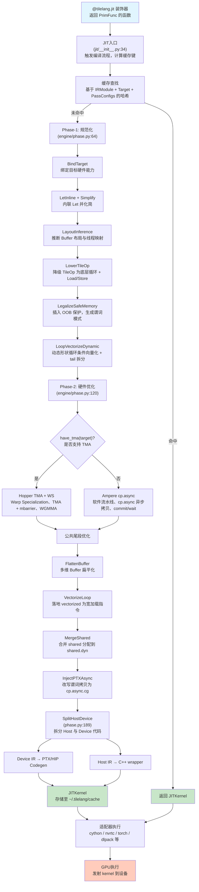

# 1. tilelang是什么

官方介绍：Tile 语言（tile-lang）是一种简洁的领域特定语言，旨在简化高性能 GPU/CPU 内核（例如 GEMM、反量化 GEMM、FlashAttention、LinearAttention）的开发。通过采用类 Python 语法以及基于 TVM 构建的底层编译器基础设施，tile-lang 让开发者能够专注于提升 productivity，同时又不牺牲实现最先进性能所必需的底层优化。[Welcome to Tile Language](https://tilelang.com/)

## 2. 如何使用tilelang编写算子

tilelang提供了三种接口面向三种不同的需求


以矩阵乘为例

**Level 1: 纯数学描述**

```python
M, N, K = 128, 128, 128
@T.prim_func
def l1_gemm(A: T.Buffer((M, K), "float16"), B: T.Buffer((K, N), "float16"), C: T.Buffer((M, N), "float16")):
    for i in T.Parallel(M):
        for j in T.Parallel(N):
            acc = T.alloc_local((1,), "float")
            T.clear(acc)
            for k in T.serial(K):
                acc[0] += A[i, k].astype("float") * B[k, j].astype("float")
            C[i, j] = acc[0].astype("float16")
```

**Level 2: Tile + Software Pipeline**

```python
M, N, K = 128, 128, 128
@T.prim_func
def l2_gemm(A: T.Buffer((M, K), "float16"), B: T.Buffer((K, N), "float16"), C: T.Buffer((M, N), "float16")):
    BLOCK_M, BLOCK_N, BLOCK_K = 128, 128, 32
    with T.Kernel(T.ceildiv(N, BLOCK_N), T.ceildiv(M, BLOCK_M), threads=128) as (bx, by):
        A_shared = T.alloc_shared((BLOCK_M, BLOCK_K), "float16")
        B_shared = T.alloc_shared((BLOCK_K, BLOCK_N), "float16")
        C_frag = T.alloc_fragment((BLOCK_M, BLOCK_N), "float")
        T.clear(C_frag)
        for ko in T.Pipelined(T.ceildiv(K, BLOCK_K), num_stages=3):
            # T.copy 使用 src 在前, dst 在后的顺序
            T.copy(A[by * BLOCK_M:(by + 1) * BLOCK_M, ko * BLOCK_K:(ko + 1) * BLOCK_K], A_shared)
            T.copy(B[ko * BLOCK_K:(ko + 1) * BLOCK_K, bx * BLOCK_N:(bx + 1) * BLOCK_N], B_shared)
            T.gemm(A_shared, B_shared, C_frag)
        T.copy(C_frag, C[by * BLOCK_M:(by + 1) * BLOCK_M, bx * BLOCK_N:(bx + 1) * BLOCK_N])
```

**Level 3: Thread-Level**

```python
M, N, K = 128, 128, 128
@T.prim_func
def l3_gemm(A: T.Buffer((M, K), "float16"), B: T.Buffer((K, N), "float16"), C: T.Buffer((M, N), "float16")):
    BLOCK_M, BLOCK_N, TILE_K = 16, 16, 8
    with T.Kernel(T.ceildiv(N, BLOCK_N), T.ceildiv(M, BLOCK_M), threads=(BLOCK_N, BLOCK_M)) as (bx, by):
        tx, ty = T.get_thread_binding(0), T.get_thread_binding(1)
        i, j = by * BLOCK_M + ty, bx * BLOCK_N + tx
        acc = T.alloc_local((1,), "float")
        T.clear(acc)
        for ko in T.serial(T.ceildiv(K, TILE_K)):
            for kk in T.serial(TILE_K):
                k = ko * TILE_K + kk
                if i < M and j < N and k < K:
                    acc[0] += A[i, k].astype("float") * B[k, j].astype("float")
        if i < M and j < N:
            C[i, j] = acc[0].astype("float16")
```

# 3. tilelang的编译

编译流程可以分为两个phase

```
用户代码: @tilelang.jit
             ↓
        JIT入口 (jit/__init__.py:34)
             ↓
        缓存查找 ← 命中? → 返回JITKernel 
             ↓ 未命中
        ┌──────────────────────────┐
        │  Phase-1: 规范化          │
        │  (engine/phase.py:64)    │
        ├──────────────────────────┤
        │ BindTarget               │
        │ LetInline + Simplify     │
        │ LayoutInference          │
        │ LowerTileOp              │
        │ LegalizeSafeMemory       │
        │ LoopVectorizeDynamic     │
        └──────────────────────────┘
             ↓
        ┌──────────────────────────┐
        │  Phase-2: 硬件优化        │
        │  (engine/phase.py:120)   │
        ├──────────────────────────┤
        │  ┌─────────┬─────────┐   │
        │  │ Hopper  │ Ampere  │   │
        │  │ TMA+WS  │ cp.async│   │
        │  └─────────┴─────────┘   │
        │         ↓                │
        │  [公共尾段]               │
        │  · FlattenBuffer         │
        │  · VectorizeLoop         │
        │  · MergeShared           │
        │  · InjectPTXAsync        │
        └──────────────────────────┘
             ↓
        SplitHostDevice (phase.py:189)
        ├─ Device IR → PTX/HIP
        └─ Host IR → C++ wrapper
             ↓
        JITKernel (缓存)
             ↓
        适配器执行 (adapter/)
             ↓
        GPU执行
```

具体的

```
用户代码: @tilelang.jit  # 装饰返回 PrimFunc 的函数
↓
JIT入口 (jit/__init__.py:34)  # 触发编译流程，计算缓存键
↓
缓存查找  # 基于 IRModule + Target + PassConfigs 的哈希
命中? → 返回JITKernel 
未命中 ↓
Phase-1: 规范化 (engine/phase.py:64)  # 将高层 DSL 转为可优化的标准 TIR
    BindTarget  # 绑定目标硬件能力（如 Hopper/Ampere、共享内存大小等）→ 后续 Pass 决策依据
    LetInline + Simplify  # 内联 Let 表达式并化简代数/常量 → 降低 IR 复杂度，便于模式匹配
    LayoutInference  # 推断 Buffer 布局（row-major/swizzled）与线程映射 → 固化索引计算方式
    LowerTileOp  # 将 T.copy / T.gemm 等 TileOp 降级为底层循环 + BufferLoad/Store → 生成访存模式与边界条件
    LegalizeSafeMemory  # 为越界访存插入 OOB 保护 → 生成 if(pred) load else 0 谓词模式（cp.async/TMA 识别基础）
    LoopVectorizeDynamic  # 对动态形状循环进行条件向量化 + tail 拆分 → 标记 vectorized 注解，等待 Phase-2 落地
↓
Phase-2: 硬件优化 (engine/phase.py:120)  # 根据 Target 能力选择优化路径
    have_tma(target)?  # 判断是否支持 TMA
    是 → Hopper TMA+WS  # Warp Specialization (Producer/Consumer 拆分), TMA + mbarrier 协议注入, WGMMA 指令生成
    否 → Ampere cp.async  # 传统软件流水线, cp.async 异步拷贝, commit_group/wait_group 同步
↓
公共尾段  # 所有硬件共享的优化步骤
    FlattenBuffer  # 多维 Buffer 扁平化为一维 → 便于地址计算
    VectorizeLoop  # 将 vectorized 循环落地为宽加载指令（如 ldg.128）
    MergeShared  # 合并多个 shared 分配到 shared.dyn → 减少地址碎片
    InjectPTXAsync  # 识别 if(pred) { shared = global } else { =0 } → 改写为 cp.async.cg.shared.global
↓
SplitHostDevice (phase.py:189)  # 拆分 Host 与 Device 代码
    Device IR → PTX/HIP Codegen  # 设备端IR转化为PTX或HIP代码
    Host IR → C++ wrapper  # 主机端IR转化为C++封装
↓
JITKernel (缓存)  # 存储至 ~/.tilelang/cache
↓
适配器执行 (adapter/)  # 执行适配器，例如cython（高性能）、nvrtc（运行时编译）、torch（Metal/MPS）、dlpack（零拷贝）
↓
GPU执行  # 发射kernel到设备
```



**参考：**

+ [Welcome to Tile Language](https://tilelang.com/)
+ [TileLang 深入详解 - 第二章 - TileLang 核心编程抽象](https://zhuanlan.zhihu.com/p/1968059451702506989)
