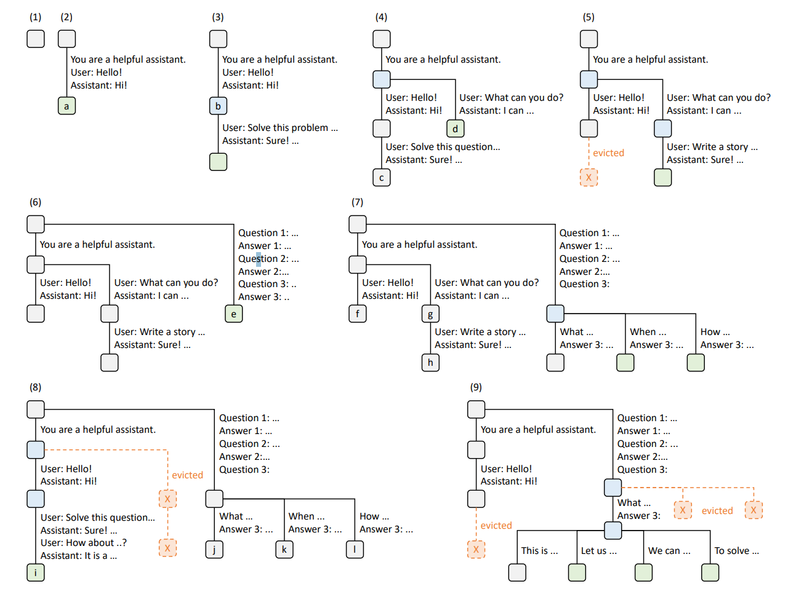
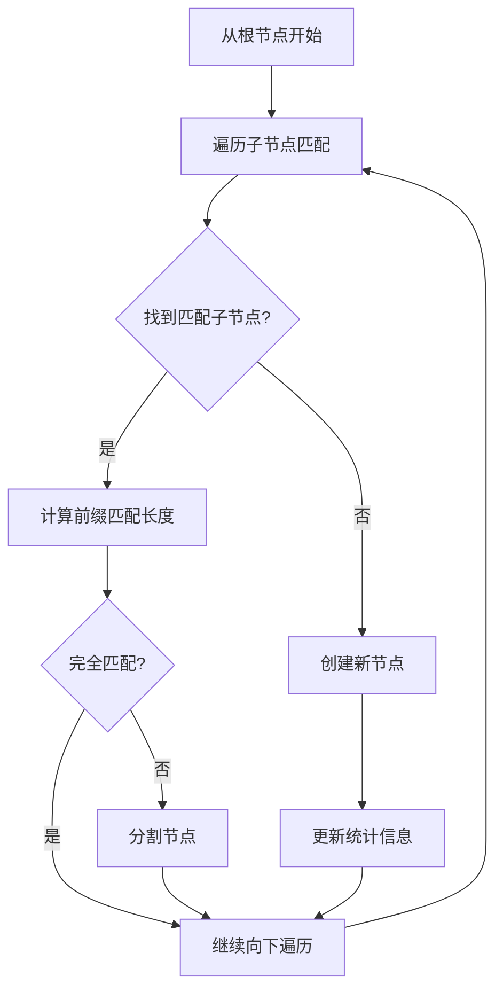
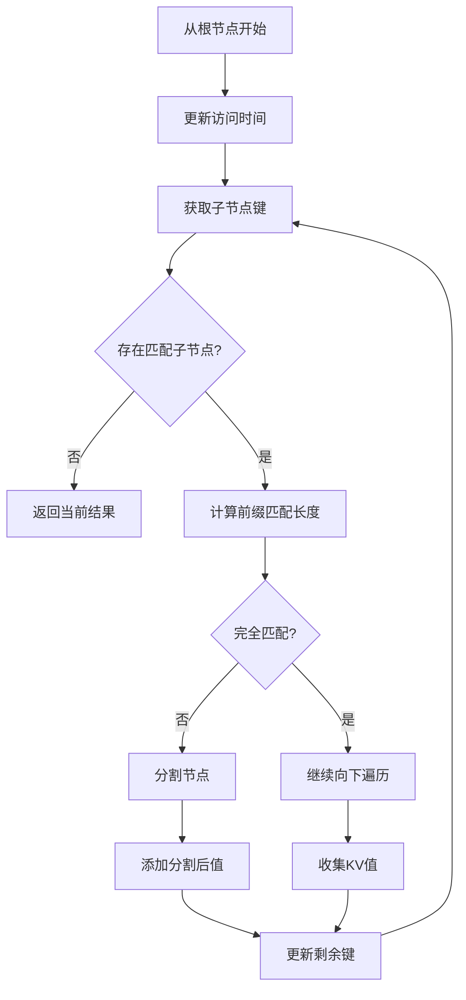

# 1. prefix cache是什么

在大模型推理中，在一轮或多轮对话中常常会有多个请求，普遍的，为了优化推理速度推理框架会对一个请求做kv cache方便之后在decode阶段使用。但是在处理完一个请求后，这个请求的kv cache不会存储，而之后的请求有相当大的概率会与之前的请求有相同的token从而有相同的kv cache。

所以一个优化方法是存储之前的kv cache，在新的请求到来时先匹配之前的kv cache这样就省去了一部分计算的时间，这种优化方法就叫做prefix cache(or caching?)

# 2. radix cache是什么

在具体实现prefix cache的时候需要考虑两个问题：怎么存储cache和怎么匹配cache

在vllm中使用hash表来存储和匹配，而在sglang中使用radix tree（基数树）来进行存储和匹配。

所谓radix tree，类似于字典树，不过radix tree的节点不是一个token，而是连续的一串token，即radix tree会将只有一个子节点的连续路径合并。



如图为radix cache大致的流程示意:

(1)(2)：输入一个user prompt和system prompt，生成一个a节点（绿色表示新生成）

(3)：输入一个新的user prompt，此时可以复用b节点的cache（蓝色表示复用）

(4)：在system prompt基础上输入另一个新的user prompt，a节点分裂为两个节点，将共有的前缀system prompt作为父节点，复用之前的system prompt的cache，生成新节点d

(5)：在节点d的基础上继续输入新的prompt，可以服用system prompt和d节点的cache，此时evicted出c节点（LRU或其他策略，红色表示逐出）

(6)：重新进行多轮对话生成新节点e

(7)：对于Q3，生成多个回答，每个回答可以复用e节点

(8)：输入新的prompt，复用两个节点的cache，生成新的节点i，逐出两个节点

(9)：在answer3基础上，复用两个cache，生成多个新节点

关于具体的解释可以参见这篇文章：[Prefix Caching 详解：实现 KV Cache 的跨请求高效复用](https://zhuanlan.zhihu.com/p/1915173348436054604)

# 3. sglang中radix cache的实现

## 3.1 RadixCache类

sglang中使用RadixCache类管理radix cache，此类继承自BasePrefixCache（这个类主要作为一个抽象类），RadixCache初始化如下：

```python
    def __init__(self, params: CacheInitParams):
        self.disable = params.disable
        self.req_to_token_pool = params.req_to_token_pool
        self.token_to_kv_pool_allocator = params.token_to_kv_pool_allocator
        self.page_size = params.page_size
        self.enable_kv_cache_events = params.enable_kv_cache_events
        self.is_eagle = params.is_eagle
        self.disable_finished_insert = params.disable_finished_insert
        self.eviction_policy = params.eviction_policy.lower()

        self.kv_event_queue = []

        if params.enable_metrics:
            self.init_metrics_collector()

        if self.token_to_kv_pool_allocator:
            self.device = self.token_to_kv_pool_allocator.device
        else:
            self.device = torch.device("cpu")

        if self.page_size == 1:
            self.key_match_fn = _key_match_page_size1
            self.get_child_key_fn = get_child_key
        else:
            self.key_match_fn = partial(_key_match_paged, page_size=self.page_size)
            self.get_child_key_fn = partial(get_child_key, page_size=self.page_size)

        if self.eviction_policy == "lru":
            self.eviction_strategy: EvictionStrategy = LRUStrategy()
        elif self.eviction_policy == "lfu":
            self.eviction_strategy: EvictionStrategy = LFUStrategy()
        elif self.eviction_policy == "fifo":
            self.eviction_strategy: EvictionStrategy = FIFOStrategy()
        elif self.eviction_policy == "mru":
            self.eviction_strategy: EvictionStrategy = MRUStrategy()
        elif self.eviction_policy == "filo":
            self.eviction_strategy: EvictionStrategy = FILOStrategy()
        elif self.eviction_policy == "priority":
            self.eviction_strategy: EvictionStrategy = PriorityStrategy()
        else:
            raise ValueError(
                f"Unknown eviction policy: {self.eviction_policy}. Supported policies: 'lru', 'lfu', 'fifo', 'mru', 'filo', 'priority'."
            )
        self.reset()
```

其他的好理解，重点说一下page_size的作用，radix tree有多个节点，每个节点需要有一个key来表示其存储的token序列，在进行匹配的时候我们将输入的token与key进行比较判断是否相等或部分匹配，比较的粒度是一个page，而page_size决定了一页中有多少token，例如page_size=16则一页存储16个token，同时key的大小也为16个token。

## 3.2 从scheduler到match_prefix

`run_scheduler_process`启动scheduler，同时运行scheduler的`event_loop`函数，`event_loop`中循环接受请求，处理请求，运行`get_next_batch_to_run`函数，`get_next_batch_to_run`调用`get_new_batch_prefill`，`get_new_batch_prefill`调用`SchedulePolicy.calc_priority`

`calc_priority`根据前缀匹配程度修改请求在队列的顺序，其调用`_compute_prefix_matches`计算每个req匹配到的长度，并且将匹配到的短长度的请求放在末尾，注意在`_compute_prefix_matches`中有一个`waiting_queue_radix_tree`，这个树是用来存储匹配短长度请求的前缀的，即对于匹配的长度较短的，从`waiting_queue_radix_tree`查找是否有长的，如果没有则加入，那么下一次有类似的前缀的匹配短长度的请求就可以重用第一次加入`waiting_queue_radix_tree`的cache了。

这时batch里面的req已经排好序了，再经过`init_next_round_input`函数存储匹配的索引之类的信息，经过一系列处理返回到`event_loop_normal`中，然后运行`run_batch`函数，

## 3.3 radix cache如何存储数据

在radixcache中，数据以treenode的数据结构存储，treenode的代码如下

```python
def __init__(self, id: Optional[int] = None, priority: int = 0):
    	# 子节点，如果不存在自动创建
        self.children = defaultdict(TreeNode)
        self.parent: TreeNode = None
        self.key: RadixKey = None
        self.value: Optional[torch.Tensor] = None
        self.lock_ref = 0
        self.last_access_time = time.monotonic()
        self.creation_time = time.monotonic()

        self.hit_count = 0
        # indicating the node is locked to protect from eviction
        # incremented when the node is referenced by a storage operation
        self.host_ref_counter = 0
        # store the host indices of KV cache
        self.host_value: Optional[torch.Tensor] = None
        # store hash values of each pages
        self.hash_value: Optional[List[str]] = None
        # priority for priority-aware eviction
        self.priority = priority

        self.id = TreeNode.counter if id is None else id
        TreeNode.counter += 1
```

## 3.4 radix cache的插入操作

插入操作主要在`insert`函数和`_insert_helper`函数中，`_insert_helper`逻辑如下：




## 3.5 radix cache的match操作

逻辑如下：



## 3.6 如何使用匹配到的cache

匹配到cache后会返回device_indices，这是对应kv cache存储的token，req中的prefix_indices会存储它，然后通过token_to_kv_pool_allocator可以获得具体的kvcache的位置然后使用

## 3.7 如何更新radix cache

在prefill未完成，prefill完成，每次decode会调用`cache_unfinished_req`或`release_kv_cache(cache_finished_req)`更新radix cache

**参考：**

+ [KV-Cache复用：SGLang RadixCache源码解读](https://zhuanlan.zhihu.com/p/1981142131348350886)
+ [Prefix Caching 详解：实现 KV Cache 的跨请求高效复用](https://zhuanlan.zhihu.com/p/1915173348436054604)