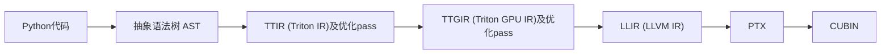

# 1. triton编译流程

triton的编译流程可以简单的概括为



以下的例子均以triton的vector_add kernel为例，代码如下：

```python
@triton.jit
def add_kernel(x_ptr,  # *Pointer* to first input vector.
               y_ptr,  # *Pointer* to second input vector.
               output_ptr,  # *Pointer* to output vector.
               n_elements,  # Size of the vector.
               BLOCK_SIZE: tl.constexpr,  # Number of elements each program should process.
               # NOTE: `constexpr` so it can be used as a shape value.
               ):
    pid = tl.program_id(axis=0)  # We use a 1D launch grid so axis is 0.
    block_start = pid * BLOCK_SIZE
    offsets = block_start + tl.arange(0, BLOCK_SIZE)
    mask = offsets < n_elements
    x = tl.load(x_ptr + offsets, mask=mask)
    y = tl.load(y_ptr + offsets, mask=mask)
    output = x + y
    tl.store(output_ptr + offsets, output, mask=mask)
```

# 2. 从python到AST

可以使用python 的ast 内置函数库，将python语法解析为ast的形式（triton是否直接使用的ast库存疑）

可以使用如下代码解析（注意可能报错JITFunction不能被getsource，这个时候把kernel保存到另一个文件然后用读取的方式打开）

```python
source = inspect.getsource(add_kernel)
tree = ast.parse(source)
print(ast.dump(tree))
```

AST代码：

```
FunctionDef(
  name='add_kernel',
  args=arguments(
    posonlyargs=[],
    args=[
      arg(arg='x_ptr'),
      arg(arg='y_ptr'),
      arg(arg='output_ptr'),
      arg(arg='n_elements'),
      arg(
        arg='BLOCK_SIZE',
        annotation=Attribute(
          value=Name(id='tl', ctx=Load()),
          attr='constexpr',
          ctx=Load()))],
    kwonlyargs=[],
    kw_defaults=[],
    defaults=[]),
  body=[
    Assign(
      targets=[
        Name(id='pid', ctx=Store())],
      value=Call(
        func=Attribute(
          value=Name(id='tl', ctx=Load()),
          attr='program_id',
          ctx=Load()),
        args=[],
        keywords=[
          keyword(
            arg='axis',
            value=Constant(value=0))])),
    Assign(
      targets=[
        Name(id='block_start', ctx=Store())],
      value=BinOp(
        left=Name(id='pid', ctx=Load()),
        op=Mult(),
        right=Name(id='BLOCK_SIZE', ctx=Load()))),
    Assign(
      targets=[
        Name(id='offsets', ctx=Store())],
      value=BinOp(
        left=Name(id='block_start', ctx=Load()),
        op=Add(),
        right=Call(
          func=Attribute(
            value=Name(id='tl', ctx=Load()),
            attr='arange',
            ctx=Load()),
          args=[
            Constant(value=0),
            Name(id='BLOCK_SIZE', ctx=Load())],
          keywords=[]))),
    Assign(
      targets=[
        Name(id='mask', ctx=Store())],
      value=Compare(
        left=Name(id='offsets', ctx=Load()),
        ops=[
          Lt()],
        comparators=[
          Name(id='n_elements', ctx=Load())])),
    Assign(
      targets=[
        Name(id='x', ctx=Store())],
      value=Call(
        func=Attribute(
          value=Name(id='tl', ctx=Load()),
          attr='load',
          ctx=Load()),
        args=[
          BinOp(
            left=Name(id='x_ptr', ctx=Load()),
            op=Add(),
            right=Name(id='offsets', ctx=Load()))],
        keywords=[
          keyword(
            arg='mask',
            value=Name(id='mask', ctx=Load()))])),
    Assign(
      targets=[
        Name(id='y', ctx=Store())],
      value=Call(
        func=Attribute(
          value=Name(id='tl', ctx=Load()),
          attr='load',
          ctx=Load()),
        args=[
          BinOp(
            left=Name(id='y_ptr', ctx=Load()),
            op=Add(),
            right=Name(id='offsets', ctx=Load()))],
        keywords=[
          keyword(
            arg='mask',
            value=Name(id='mask', ctx=Load()))])),
    Assign(
      targets=[
        Name(id='output', ctx=Store())],
      value=BinOp(
        left=Name(id='x', ctx=Load()),
        op=Add(),
        right=Name(id='y', ctx=Load()))),
    Expr(
      value=Call(
        func=Attribute(
          value=Name(id='tl', ctx=Load()),
          attr='store',
          ctx=Load()),
        args=[
          BinOp(
            left=Name(id='output_ptr', ctx=Load()),
            op=Add(),
            right=Name(id='offsets', ctx=Load())),
          Name(id='output', ctx=Load())],
        keywords=[
          keyword(
            arg='mask',
            value=Name(id='mask', ctx=Load()))]))],
  decorator_list=[
    Attribute(
      value=Name(id='triton', ctx=Load()),
      attr='jit',
      ctx=Load())])
```

# 3. 从AST到TTIR

Triton IR是Triton编译器的高级中间表示，是硬件无关的。其特点包括：

-  高级抽象：使开发者用接近于高级深度学习框架的方式来描述计算图。 
-  操作表示：包含了一系列的操作，如矩阵乘法、卷机、激活函数等。 
-  优化：编译器可以应用一些高级优化，如死代码消除、常量折叠等。

通过继承自NodeVisitor的自定义类`class CodeGenerator(ast.NodeVisitor)，路径为python/triton/compiler/code_generator.py`，遍历AST的每个节点并解析（使用`CodeGenerator的visit_xxx`方法）

例如对于`arguments`，有`visit_arguments`方法

```python
def visit_arguments(self, node):
        arg_names = []
        for arg in node.args:
            arg_names += [self.visit(arg)]
        kwarg_names = self.visit(node.kwarg)
        return arg_names, kwarg_names
```

对整个AST使用visit方法生成TTIR

```python
    generator = CodeGenerator(context, prototype, gscope=gscope, constants=all_constants, function_name=function_name,
                              jit_fn=fn, attributes=new_attrs, is_kernel=True, file_name=file_name,
                              begin_line=begin_line, options=options, codegen_fns=codegen_fns, module_map=module_map)
    generator.visit(fn.parse())
```

对于上面的`vector_add` kernel，可以得到

```
module {
  // === Triton kernel 函数定义 ===
  // 函数名：@add_kernel
  // 参数均为 GPU 全局内存指针或标量，且对齐到 16 字节（优化内存访问）
  tt.func public @add_kernel(
    %x_ptr: !tt.ptr<f32> {tt.divisibility = 16 : i32} loc("x_ptr"(#loc)),
    %y_ptr: !tt.ptr<f32> {tt.divisibility = 16 : i32} loc("y_ptr"(#loc)),
    %output_ptr: !tt.ptr<f32> {tt.divisibility = 16 : i32} loc("output_ptr"(#loc)),
    %n_elements: i32 {tt.divisibility = 16 : i32} loc("n_elements"(#loc))
  ) attributes { noinline = false } {

    // === 常量：BLOCK_SIZE = 1024（来自 tl.constexpr）===
    %c1024_i32 = arith.constant 1024 : i32 loc(#loc1)

    // === 获取当前 block 的 ID（等价于 tl.program_id(0)）===
    %pid = tt.get_program_id x : i32 loc(#loc19)

    // === 计算当前 block 起始元素索引：block_start = pid * 1024 ===
    %block_start = arith.muli %pid, %c1024_i32 : i32 loc(#loc20)

    // === 生成局部偏移 [0, 1, ..., 1023]（等价于 tl.arange(0, 1024)）===
    %offsets = tt.make_range {end = 1024 : i32, start = 0 : i32} : tensor<1024xi32> loc(#loc21)

    // === 将 block_start 广播为长度 1024 的向量 ===
    %offsets_0 = tt.splat %block_start : i32 -> tensor<1024xi32> loc(#loc22)

    // === 计算全局偏移：offsets_global = block_start + [0..1023] ===
    %offsets_1 = arith.addi %offsets_0, %offsets : tensor<1024xi32> loc(#loc22)

    // === 构建边界掩码：mask = (offsets_global < n_elements) ===
    %mask = tt.splat %n_elements : i32 -> tensor<1024xi32> loc(#loc23)
    %mask_2 = arith.cmpi slt, %offsets_1, %mask : tensor<1024xi32> loc(#loc23)

    // === 加载 x 数据 ===
    // 1. 广播 x_ptr 为 1024 个指针
    %x = tt.splat %x_ptr : !tt.ptr<f32> -> tensor<1024x!tt.ptr<f32>> loc(#loc24)
    // 2. 指针算术：x_ptr + offsets_global
    %x_3 = tt.addptr %x, %offsets_1 : tensor<1024x!tt.ptr<f32>>, tensor<1024xi32> loc(#loc24)
    // 3. 带掩码加载（仅加载有效位置）
    %x_4 = tt.load %x_3, %mask_2 : tensor<1024x!tt.ptr<f32>> loc(#loc25)

    // === 加载 y 数据（同理）===
    %y = tt.splat %y_ptr : !tt.ptr<f32> -> tensor<1024x!tt.ptr<f32>> loc(#loc26)
    %y_5 = tt.addptr %y, %offsets_1 : tensor<1024x!tt.ptr<f32>>, tensor<1024xi32> loc(#loc26)
    %y_6 = tt.load %y_5, %mask_2 : tensor<1024x!tt.ptr<f32>> loc(#loc27)

    // === 向量加法：output = x + y ===
    %output = arith.addf %x_4, %y_6 : tensor<1024xf32> loc(#loc28)

    // === 存储结果到 output_ptr ===
    // 1. 广播 output_ptr
    %0 = tt.splat %output_ptr : !tt.ptr<f32> -> tensor<1024x!tt.ptr<f32>> loc(#loc12)
    // 2. 计算输出地址：output_ptr + offsets_global
    %1 = tt.addptr %0, %offsets_1 : tensor<1024x!tt.ptr<f32>>, tensor<1024xi32> loc(#loc12)
    // 3. 带掩码存储（仅写入有效位置）
    tt.store %1, %output, %mask_2 : tensor<1024x!tt.ptr<f32>> loc(#loc13)

    // === 函数返回（kernel 无返回值）===
    tt.return loc(#loc14)
  } loc(#loc)
}
```

得到ttir后，执行一系列优化pass

```python
    @staticmethod
    def make_ttir(mod, metadata, opt):
        pm = ir.pass_manager(mod.context)
        pm.enable_debug()
        passes.common.add_inliner(pm)
        passes.ttir.add_rewrite_tensor_pointer(pm)
        passes.ttir.add_combine(pm)
        passes.common.add_canonicalizer(pm)
        passes.ttir.add_reorder_broadcast(pm)
        passes.common.add_cse(pm)
        passes.common.add_licm(pm)
        passes.common.add_symbol_dce(pm)
        passes.ttir.add_loop_unroll(pm)
        pm.run(mod)
        return mod
```

这里的mod输入就是ttir，各个pass分别为

| Pass                         | 功能                                           | 处理对象          |
| ---------------------------- | ---------------------------------------------- | ----------------- |
| `add_inliner`                | 内联函数调用，减少函数调用开销 compiler.py:234 | tt.call操作       |
| `add_rewrite_tensor_pointer` | 将张量指针操作转换为传统语义 compiler.py:235   | tt.load/tt.store  |
| `add_combine`                | 合并特定操作模式（如dot+add） compiler.py:239  | tt.dot, tt.addptr |
| `add_canonicalizer`          | 规范化IR形式 compiler.py:238                   | 所有操作          |
| `add_reorder_broadcast`      | 延迟广播操作到元素级操作之后 compiler.py:240   | broadcast操作     |
| `add_cse`                    | 消除公共子表达式 compiler.py:241               | 重复计算          |
| `add_licm`                   | 循环不变代码提升 compiler.py:242               | 循环内不变操作    |
| `add_symbol_dce`             | 移除未使用的符号 compiler.py:243               | 死代码            |
| `add_loop_unroll`            | 循环展开优化 compiler.py:244                   | scf.for循环       |

# 4. 从TTIR到TTGIR

Triton GPU IR是专门针对GPU硬件优化的中间表示。其特点包括： 

- 硬件特定优化：包含针对特定GPU架构的优化，如内存访问模式、线程布局等。 
- 并行性表示：能够表示并行性，如线程块、网格等。 
- 性能优化：可以进行更细致的性能优化，如内存访问优化等。

使用`make_ttgir`函数完成TTIR到TTGIR的转换及优化

在这个函数中，首先使用pass `passes.ttir.add_convert_to_ttgpuir(pm, f"cuda:{capability}", opt.num_warps, 32, opt.num_ctas)`将ttir转换为ttgir，生成的ttgir如下：

```
// === 定义张量在 GPU 上的物理布局（blocked layout）===
// 表示一个 1D 张量如何分布在 CTA（CUDA Thread Block）中：
// - 每个线程处理 4 个连续元素
// - 每个 warp 有 32 个线程（共 128 元素/warp）
// - 每个 CTA 有 4 个 warps（共 512 元素/CTA）
// 注意：虽然类型写 tensor<1024x...>，但 layout 描述的是底层分块策略
#blocked = #ttg.blocked<{sizePerThread = [4], threadsPerWarp = [32], warpsPerCTA = [4], order = [0]}>

// === 模块级属性：描述目标 GPU 配置 ===
module attributes {
  "ttg.num-ctas" = 1 : i32,           // 使用 1 个 CTA（即 1 个 CUDA block）
  "ttg.num-warps" = 4 : i32,          // 每个 CTA 包含 4 个 warps（共 128 线程）
  ttg.target = "cuda:89",             // 目标 GPU 架构（如 A100/H100）
  "ttg.threads-per-warp" = 32 : i32   // 每个 warp 32 线程（标准 CUDA）
} {

  // === Kernel 函数定义（与 TTIR 相同，但张量带 layout）===
  tt.func public @add_kernel(
    %x_ptr: !tt.ptr<f32> {tt.divisibility = 16 : i32} loc("x_ptr"(#loc)),
    %y_ptr: !tt.ptr<f32> {tt.divisibility = 16 : i32} loc("y_ptr"(#loc)),
    %output_ptr: !tt.ptr<f32> {tt.divisibility = 16 : i32} loc("output_ptr"(#loc)),
    %n_elements: i32 {tt.divisibility = 16 : i32} loc("n_elements"(#loc))
  ) attributes { noinline = false } {

    // === 常量：BLOCK_SIZE = 1024 ===
    %c1024_i32 = arith.constant 1024 : i32 loc(#loc1)

    // === 获取当前 CTA 的 ID（等价于 blockIdx.x）===
    %pid = tt.get_program_id x : i32 loc(#loc19)

    // === 计算当前 CTA 负责的起始元素索引 ===
    %block_start = arith.muli %pid, %c1024_i32 : i32 loc(#loc20)

    // === 生成局部偏移 [0, 1, ..., 1023]，并标注其 GPU 布局为 #blocked ===
    // 注意：虽然逻辑上是 1024 个元素，但实际会按 #blocked 分布到 128 个线程（每个处理 8 个？）
    // 可能此处 layout 与 size 不完全匹配，属于中间表示
    %offsets = tt.make_range {end = 1024 : i32, start = 0 : i32} : tensor<1024xi32, #blocked> loc(#loc21)

    // === 将标量 block_start 广播为带 #blocked 布局的向量 ===
    %offsets_0 = tt.splat %block_start : i32 -> tensor<1024xi32, #blocked> loc(#loc22)

    // === 计算全局偏移：每个线程的全局索引 = block_start + local_offset ===
    %offsets_1 = arith.addi %offsets_0, %offsets : tensor<1024xi32, #blocked> loc(#loc22)

    // === 构建边界掩码：mask[i] = (global_offset[i] < n_elements) ===
    %mask = tt.splat %n_elements : i32 -> tensor<1024xi32, #blocked> loc(#loc23)
    %mask_2 = arith.cmpi slt, %offsets_1, %mask : tensor<1024xi32, #blocked> loc(#loc23)

    // === 加载 x 数据 ===
    // 1. 广播 x_ptr 到每个线程（带 #blocked 布局）
    %x = tt.splat %x_ptr : !tt.ptr<f32> -> tensor<1024x!tt.ptr<f32>, #blocked> loc(#loc24)
    // 2. 指针算术：每个线程计算自己的地址 = x_ptr + global_offset
    %x_3 = tt.addptr %x, %offsets_1 : tensor<1024x!tt.ptr<f32>, #blocked>, tensor<1024xi32, #blocked> loc(#loc24)
    // 3. 带掩码加载：仅当 mask_2[i]==true 时加载，避免越界
    //    结果是一个分布式的 f32 张量，每个线程持有部分数据
    %x_4 = tt.load %x_3, %mask_2 : tensor<1024x!tt.ptr<f32>, #blocked> loc(#loc25)

    // === 加载 y 数据（同理）===
    %y = tt.splat %y_ptr : !tt.ptr<f32> -> tensor<1024x!tt.ptr<f32>, #blocked> loc(#loc26)
    %y_5 = tt.addptr %y, %offsets_1 : tensor<1024x!tt.ptr<f32>, #blocked>, tensor<1024xi32, #blocked> loc(#loc26)
    %y_6 = tt.load %y_5, %mask_2 : tensor<1024x!tt.ptr<f32>, #blocked> loc(#loc27)

    // === 向量加法：每个线程对其持有的元素执行 x + y ===
    // 结果 %output 也是一个分布式张量，layout 为 #blocked
    %output = arith.addf %x_4, %y_6 : tensor<1024xf32, #blocked> loc(#loc28)

    // === 存储结果 ===
    // 1. 广播 output_ptr
    %0 = tt.splat %output_ptr : !tt.ptr<f32> -> tensor<1024x!tt.ptr<f32>, #blocked> loc(#loc12)
    // 2. 计算输出地址
    %1 = tt.addptr %0, %offsets_1 : tensor<1024x!tt.ptr<f32>, #blocked>, tensor<1024xi32, #blocked> loc(#loc12)
    // 3. 带掩码存储：仅写入有效位置
    tt.store %1, %output, %mask_2 : tensor<1024x!tt.ptr<f32>, #blocked> loc(#loc13)

    // === 返回 ===
    tt.return loc(#loc14)
  } loc(#loc)
}
```

类似的，TTGIR也有一系列优化pass

| 优化类别      | Pass名称                           | 功能描述                                 | 架构要求 |
| ------------- | ---------------------------------- | ---------------------------------------- | -------- |
| **内存访问**  | `add_coalesce`                     | 优化内存访问模式，提高缓存命中率         | 所有架构 |
| **内存访问**  | `add_optimize_thread_locality`     | 减少线程间同步开销                       | 所有架构 |
| **矩阵乘法**  | `add_f32_dot_tc`                   | FP32点积Tensor Core优化                  | SM80+    |
| **矩阵乘法**  | `add_accelerate_matmul`            | 将dot操作转换为Tensor Core指令           | 所有架构 |
| **矩阵乘法**  | `add_optimize_dot_operands`        | 优化矩阵乘法操作数布局                   | SM80+    |
| **布局优化**  | `add_plan_cta`                     | CTA（线程块）规划，支持多CTA执行         | 所有架构 |
| **布局优化**  | `add_remove_layout_conversions`    | 消除冗余的布局转换                       | 所有架构 |
| **性能优化**  | `add_pipeline`                     | 软件流水线，隐藏内存延迟                 | SM80+    |
| **性能优化**  | `add_prefetch`                     | 数据预取优化                             | 所有架构 |
| **性能优化**  | `add_reduce_data_duplication`      | 减少寄存器数据重复                       | 所有架构 |
| **通用优化**  | `add_cse`                          | 公共子表达式消除                         | 所有架构 |
| **通用优化**  | `add_symbol_dce`                   | 死代码消除                               | 所有架构 |
| **通用优化**  | `add_canonicalizer`                | IR规范化                                 | 所有架构 |
| **SM90+特有** | `add_fence_insertion`              | 插入内存栅栏                             | SM90+    |
| **SM90+特有** | `add_tma_lowering`                 | TMA（Tensor Memory Accelerator）lowering | SM90+    |
| **SM80+特有** | `add_optimize_accumulator_init`    | 优化累加器初始化                         | SM80+    |
| **SM80+特有** | `add_combine_tensor_select_and_if` | 合并tensor select和if操作                | SM80+    |

# 5. 从TTGIR到LLIR

LLVM IR的特点包括：

- 优化：提供了大量的优化通道，可以在LLVM IR层面进行指令组合等优化。
- 代码生成：最终会被转换为特定硬件平台的机器代码。

通过`make_llir`完成转换

通过`nvidia.passes.ttgpuir.add_to_llvmir(pm, capability, ptx_version)`pass完成ttgir到llir的转换

得到如下：

```llvm
; === 模块基本信息 ===
; ModuleID = 'LLVMDialectModule'
source_filename = "LLVMDialectModule"
target datalayout = "e-p3:32:32-p4:32:32-p5:32:32-p6:32:32-p7:32:32-i64:64-i128:128-v16:16-v32:32-n16:32:64"

; === Kernel 函数定义 ===
; - ptx_kernel: 表示这是 CUDA kernel（__global__）
; - ptr addrspace(1): 地址空间 1 = 全局内存（global memory）
; - %0=x_ptr, %1=y_ptr, %2=output_ptr, %3=n_elements
; - %4, %5 是未使用的参数（可能是占位符，来自 TTIR 接口）
define ptx_kernel void @add_kernel(
  ptr addrspace(1) %0,
  ptr addrspace(1) %1,
  ptr addrspace(1) %2,
  i32 %3,
  ptr addrspace(1) readnone captures(none) %4,
  ptr addrspace(1) readnone captures(none) %5
) local_unnamed_addr #0 !dbg !4 {

  ; === 获取 blockIdx.x（CTA ID）===
  ; 对应 tl.program_id(0)
  %7 = tail call i32 @llvm.nvvm.read.ptx.sreg.ctaid.x(), !dbg !7

  ; === block_start = blockIdx.x << 10 （即 * 1024）===
  ; 因为 2^10 = 1024，左移比乘法更高效
  %8 = shl i32 %7, 10, !dbg !8

  ; === 获取 threadIdx.x（线程在 block 内的 ID，0~127）===
  %9 = tail call i32 @llvm.nvvm.read.ptx.sreg.tid.x(), !dbg !9

  ; === 计算 base_offset_in_block = threadIdx.x * 4 ===
  ; 为什么 *4？因为每个线程先处理 4 个连续元素（第一组 v4）
  %10 = shl nuw nsw i32 %9, 2, !dbg !9   ; <<2 == *4

  ; === 对齐到 4 的倍数（确保地址对齐）===
  ; 508 = 0b111111100，清掉低 2 位（但此处其实已对齐）
  ; 实际上是为了构造两个不重叠的 4-element 块
  %11 = and i32 %10, 508, !dbg !9

  ; === 第一组全局偏移：offset0 = block_start + base_offset ===
  %12 = or disjoint i32 %11, %8, !dbg !10

  ; === 第二组全局偏移：offset1 = offset0 + 512 ===
  ; 为什么 +512？因为 1024 元素 / 2 = 512
  ; 所以线程 0 处理 [0..3] 和 [512..515]
  ; 线程 1 处理 [4..7] 和 [516..519]，依此类推
  %13 = or disjoint i32 %12, 512, !dbg !10

  ; === 构建掩码：是否越界？===
  %14 = icmp slt i32 %12, %3, !dbg !11   ; mask0 = (offset0 < n_elements)
  %15 = icmp slt i32 %13, %3, !dbg !11   ; mask1 = (offset1 < n_elements)

  ; === 将偏移转为 i64（用于指针运算）===
  %16 = sext i32 %12 to i64, !dbg !12
  %17 = getelementptr float, ptr addrspace(1) %0, i64 %16, !dbg !12  ; &x[offset0]
  %18 = sext i32 %13 to i64, !dbg !12
  %19 = getelementptr float, ptr addrspace(1) %0, i64 %18, !dbg !12  ; &x[offset1]

  ; === 从 x 加载第一组 4 个 float（v4）===
  ; 使用内联汇编模拟 PTX 的 ld.global.v4.b32
  ; 语法：@$5 ld.global.v4.b32 {r0,r1,r2,r3}, [addr]
  ; 其中 $5 是谓词（predicate），即掩码 %14
  ; 如果 %14=false，则加载 0（由前面 mov.u32 $x, 0x0 初始化）
  %20 = tail call { i32, i32, i32, i32 } asm sideeffect
        "mov.u32 $0, 0x0;\0A\09mov.u32 $1, 0x0;\0A\09mov.u32 $2, 0x0;\0A\09mov.u32 $3, 0x0;\0A\09@$5 ld.global.v4.b32 { $0, $1, $2, $3 }, [ $4 + 0 ];",
        "=r,=r,=r,=r,l,b"(ptr addrspace(1) %17, i1 %14) #2, !dbg !13

  ; === 提取 4 个 i32 值，并转为 float ===
  %21 = extractvalue { i32, i32, i32, i32 } %20, 0, !dbg !13
  %22 = extractvalue { i32, i32, i32, i32 } %20, 1, !dbg !13
  %23 = extractvalue { i32, i32, i32, i32 } %20, 2, !dbg !13
  %24 = extractvalue { i32, i32, i32, i32 } %20, 3, !dbg !13
  %25 = bitcast i32 %21 to float, !dbg !13
  %26 = bitcast i32 %22 to float, !dbg !13
  %27 = bitcast i32 %23 to float, !dbg !13
  %28 = bitcast i32 %24 to float, !dbg !13

  ; === 从 x 加载第二组 4 个 float（offset1）===
  %29 = tail call { i32, i32, i32, i32 } asm sideeffect "...", "=r,=r,=r,=r,l,b"(ptr addrspace(1) %19, i1 %15) #2, !dbg !13
  %30 = extractvalue { i32, i32, i32, i32 } %29, 0, !dbg !13
  %31 = extractvalue { i32, i32, i32, i32 } %29, 1, !dbg !13
  %32 = extractvalue { i32, i32, i32, i32 } %29, 2, !dbg !13
  %33 = extractvalue { i32, i32, i32, i32 } %29, 3, !dbg !13
  %34 = bitcast i32 %30 to float, !dbg !13
  %35 = bitcast i32 %31 to float, !dbg !13
  %36 = bitcast i32 %32 to float, !dbg !13
  %37 = bitcast i32 %33 to float, !dbg !13

  ; === 从 y 加载第一组（offset0）===
  %38 = getelementptr float, ptr addrspace(1) %1, i64 %16, !dbg !14
  %39 = getelementptr float, ptr addrspace(1) %1, i64 %18, !dbg !14
  %40 = tail call { i32, i32, i32, i32 } asm sideeffect "...", "=r,=r,=r,=r,l,b"(ptr addrspace(1) %38, i1 %14) #2, !dbg !15
  %41 = extractvalue { i32, i32, i32, i32 } %40, 0, !dbg !15
  %42 = extractvalue { i32, i32, i32, i32 } %40, 1, !dbg !15
  %43 = extractvalue { i32, i32, i32, i32 } %40, 2, !dbg !15
  %44 = extractvalue { i32, i32, i32, i32 } %40, 3, !dbg !15
  %45 = bitcast i32 %41 to float, !dbg !15
  %46 = bitcast i32 %42 to float, !dbg !15
  %47 = bitcast i32 %43 to float, !dbg !15
  %48 = bitcast i32 %44 to float, !dbg !15

  ; === 从 y 加载第二组（offset1）===
  %49 = tail call { i32, i32, i32, i32 } asm sideeffect "...", "=r,=r,=r,=r,l,b"(ptr addrspace(1) %39, i1 %15) #2, !dbg !15
  %50 = extractvalue { i32, i32, i32, i32 } %49, 0, !dbg !15
  %51 = extractvalue { i32, i32, i32, i32 } %49, 1, !dbg !15
  %52 = extractvalue { i32, i32, i32, i32 } %49, 2, !dbg !15
  %53 = extractvalue { i32, i32, i32, i32 } %49, 3, !dbg !15
  %54 = bitcast i32 %50 to float, !dbg !15
  %55 = bitcast i32 %51 to float, !dbg !15
  %56 = bitcast i32 %52 to float, !dbg !15
  %57 = bitcast i32 %53 to float, !dbg !15

  ; === 执行 8 次浮点加法（4+4）===
  %58 = fadd float %25, %45, !dbg !16   ; x[0] + y[0]
  %59 = fadd float %26, %46, !dbg !16   ; x[1] + y[1]
  %60 = fadd float %27, %47, !dbg !16   ; x[2] + y[2]
  %61 = fadd float %28, %48, !dbg !16   ; x[3] + y[3]
  %62 = fadd float %34, %54, !dbg !16   ; x[4] + y[4]
  %63 = fadd float %35, %55, !dbg !16   ; x[5] + y[5]
  %64 = fadd float %36, %56, !dbg !16   ; x[6] + y[6]
  %65 = fadd float %37, %57, !dbg !16   ; x[7] + y[7]

  ; === 计算 output 存储地址 ===
  %66 = getelementptr float, ptr addrspace(1) %2, i64 %16, !dbg !17  ; &output[offset0]
  %67 = getelementptr float, ptr addrspace(1) %2, i64 %18, !dbg !17  ; &output[offset1]

  ; === 将结果转回 i32（因为 PTX st.global.v4.b32 操作的是 b32）===
  %68 = bitcast float %58 to i32, !dbg !18
  %69 = bitcast float %59 to i32, !dbg !18
  %70 = bitcast float %60 to i32, !dbg !18
  %71 = bitcast float %61 to i32, !dbg !18

  ; === 存储第一组 4 个结果（带掩码 %14）===
  tail call void asm sideeffect
        "@$5 st.global.v4.b32 [ $4 + 0 ], { $0, $1, $2, $3 };",
        "r,r,r,r,l,b"(i32 %68, i32 %69, i32 %70, i32 %71, ptr addrspace(1) %66, i1 %14) #2, !dbg !18

  ; === 存储第二组 4 个结果（带掩码 %15）===
  %72 = bitcast float %62 to i32, !dbg !18
  %73 = bitcast float %63 to i32, !dbg !18
  %74 = bitcast float %64 to i32, !dbg !18
  %75 = bitcast float %65 to i32, !dbg !18
  tail call void asm sideeffect
        "@$5 st.global.v4.b32 [ $4 + 0 ], { $0, $1, $2, $3 };",
        "r,r,r,r,l,b"(i32 %72, i32 %73, i32 %74, i32 %75, ptr addrspace(1) %67, i1 %15) #2, !dbg !18

  ; === 返回 ===
  ret void, !dbg !19
}

; === 声明 PTX 特殊寄存器读取函数 ===
declare i32 @llvm.nvvm.read.ptx.sreg.ctaid.x() #1  ; blockIdx.x
declare i32 @llvm.nvvm.read.ptx.sreg.tid.x() #1   ; threadIdx.x

; === 函数属性 ===
attributes #0 = { nounwind "nvvm.reqntid"="128" }  ; 要求 block size = 128 线程
attributes #1 = { ... }  ; 内建函数属性
attributes #2 = { nounwind }
```

这里的优化pass较少

| 优化类别     | Pass名称            | 功能描述                                                     | 调用位置 |
| ------------ | ------------------- | ------------------------------------------------------------ | -------- |
| **通用优化** | `add_canonicalizer` | IR规范化（多次调用） compiler.py:364 compiler.py:368         | 通用优化 |
| **通用优化** | `add_cse`           | 公共子表达式消除（多次调用） compiler.py:365 compiler.py:369 | 通用优化 |

**参考：**

+ [triton编译学习](https://zhuanlan.zhihu.com/p/694177180)
+ [Deep Dive into Triton Internals (Part 1)](https://www.kapilsharma.dev/posts/deep-dive-into-triton-internals/#ttir-triton-ir)
+ [Triton学习：源码结构解析与编译流程](https://zhuanlan.zhihu.com/p/16752382946)