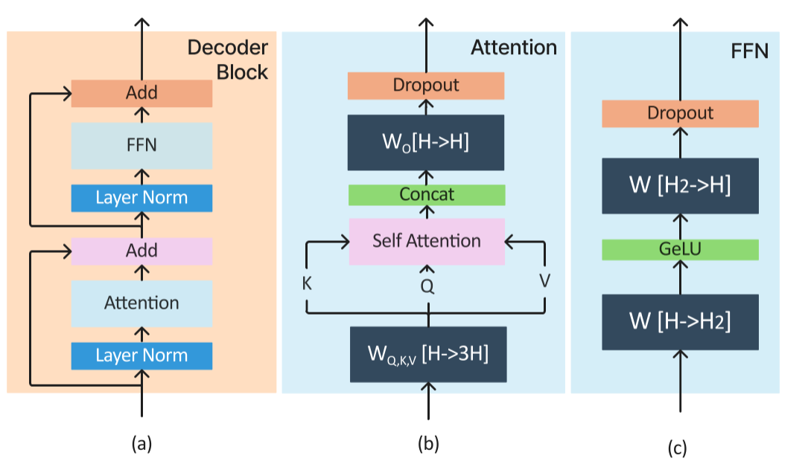
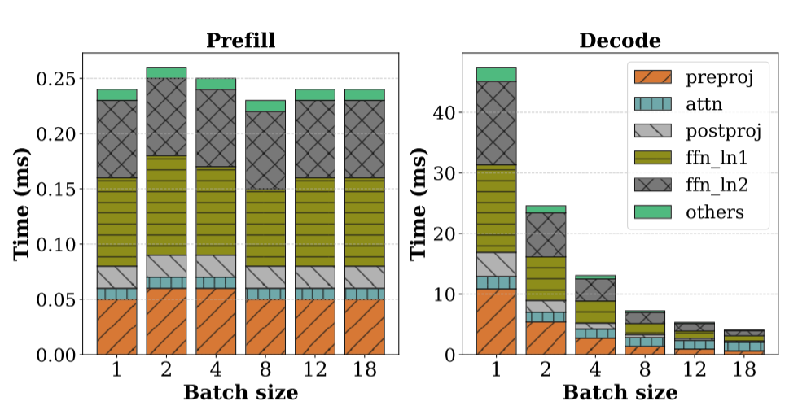
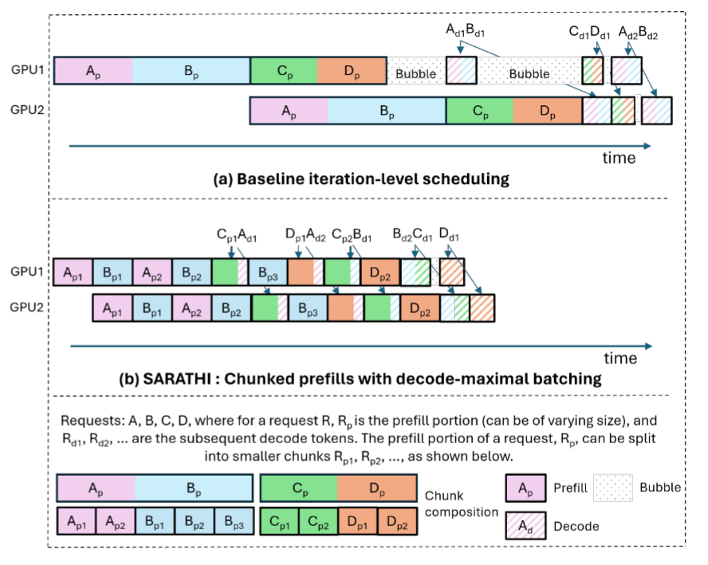

本文是对论文[SARATHI: Efficient LLM Inference by Piggybacking Decodes with Chunked Prefills](https://arxiv.org/abs/2308.16369)的阅读与分析。

# 1. motivation

随着LLM的热度地持续提升，关于LLM的训练与推理工作也成为了热门领域，对于LLM inference，一个request一般分为两个阶段：prefill和decode。prefill阶段是指对于输入的prompt，对每个token做LLM inference的计算算出kv cache和第一个输出token的概率分布，其中一个典型的LLM inference计算如图

decode是指自回归地根据前面的token输出一个新的token。

prefill和decode两个阶段对于GPU资源的需求是不一样的，prefill阶段执行的是prompt所有token的计算，即可以视为执行的是大矩阵的矩阵乘，而decode阶段执行的是一个token对应上图的计算，即可以视为执行的是一个向量矩阵乘。所以prefill阶段往往能够充分利用GPU的计算资源（即使在batch size较小的情况下），而decode阶段往往不能充分利用计算资源（除非batch size不切实际地大）。就计算强度而言：prefill计算强度较大，decode计算强度较小，即prefill属于compute-bound，decode属于memory-bound（关于计算强度可见文章[https://zhuanlan.zhihu.com/p/24066764550](https://zhuanlan.zhihu.com/p/24066764550)）。

对于每个token花费的时间prefill和decode情况如下图，可以看见prefill受batch_size影响很小，而decode受batch_size影响较大，且decode每个token花费时间比prefill高出两个数量级

根据prefill和decode两个阶段需求的不同，如何高效地排布GPU资源以应对这种不同就成为LLM inference中一个重要的问题。

# 2. problem

在大语言模型部署中，往往一张卡的内存（或显存）不足以支撑整个模型的内存需求，那么需要把大模型部署在多张卡上，即使用并行的方式来部署大模型。常见的并行方式有tensor-parallelism(TP)和pipline-parallelism(PP)，对于TP，我们往往把大模型的权重分配到多张卡上，然后在多张卡上进行计算（关于TP可见文章[Tensor Parallel](https://zhuanlan.zhihu.com/p/626008269)），但是TP执行计算后需要执行通信操作（all-gather或all-reduce），所以往往需要nvlink这样的高带宽互联。在没有高带宽互联可用的情况下，我们可以使用PP，即将大模型的不同layer分别到不同的节点上，一个节点计算出结果后将结果传送至下一个节点进行下面layer的计算。

在PP中存在一个明显的问题即bubble问题，如下图a：

可以看到在PP中存在三种情况的bubble：

(1) 不同请求之间的prefill时长不同（主要是因为不同请求prompt的token数不一样）：如$D_p$执行完后如果想执行$A_{d1}B_{d1}$需要等待$B_p$执行完毕，而$D_p$和$B_p$执行时长不同，于是就造成了bubble（这里为什么不先执行$A_{d1}$，我的理解是AB是同一个batch的，需要一起执行）。

(2)prefill和decode时长存在差异：如$A_{d1}B_{d1}$执行完后想执行$C_{d1}D_{d1}$需要等待$C_pD_p$执行完毕

(3不同请求之间的decode时长不同：如$C_{d1}D_{d1}$执行完后想执行$A_{d2}B_{d2}$需要等待另一个节点的$A_{d1}B_{d1}$执行完毕

此外，在motivation中我们也提到docode阶段每个token的耗时由于无法充分利用GPU计算资源远大于prefill阶段。

因此对于bubble问题和decode GPU资源利用不足问题，本论文提出了chunked prefill方法。

# 3. solution

## 3.1 chunked prefill概述

所谓chunk prefill，是指设定一个chunked size，将request按照chunked size大小进行切片，这样每个切片的size相同，prefill耗时相同，即可以解决第一种情况的bubble，同时我们将decode请求与切片组合在一起行程相同大小的新切片，这也可以一定程度缓解第二种和第三种bubble问题（如上图b），因为每个token对应要计算的权重是相同的，所以decode的矩阵计算可以和切片的矩阵计算融合，这样也可以解决部分decode阶段无法充分利用计算资源的问题。

## 3.2 chunked prefill开销

chunked prefill的开销主要有两点：
(1) 将一个大的请求切分为小的切片，这会降低计算强度，即有可能无法充分利用计算资源
(2) 在attention计算的时候需要重复访问部分kv cache，如下图：

假设我们有N个切片，每个切片size为M，那么在attention计算第一个切片的时候需要访问前M个kvcache，在计算第二个切片时需要访问前2M个切片，即前M个kvcache被重复访问了一次，以此类推，当访问到第N个切片时，前M个kvcache被重复访问了N次，M-2M的kvcache被访问了N-1次...

## 3.3 chunk size的选择

如何选择一个合适的chunk size以充分利用计算资源呢？

如果chunk size选择过小，那么每个切片的计算强度很小，无法充分利用计算资源

如果chunk size选择过大，那么可以附着在切片上的decode请求就有限，需要专门计算memory-bound的decode阶段

根据论文的实验，当$P:D=C/(B-1)$的时候效果最好，其中P:D指在给定的一个batch中，prefill的token数量比上decode的token数量，C为chunk size，B为batch_size

# 4. experiments

文章做了一些实验，主要验证了
(1) SARATHI中不同P:D、batch_size、seq_len对吞吐量的影响

(2) SARATHI与[Orca](https://www.usenix.org/conference/osdi22/presentation/yu)性能的对比

(3) 对于bubble减少的验证

(4) chunked prefill的开销

总的来说，这是一个已经被验证有效且被主流的推理框架支持的功能。

后面我会结合sglang探究chunked prefill的具体实现，敬请期待:smile: