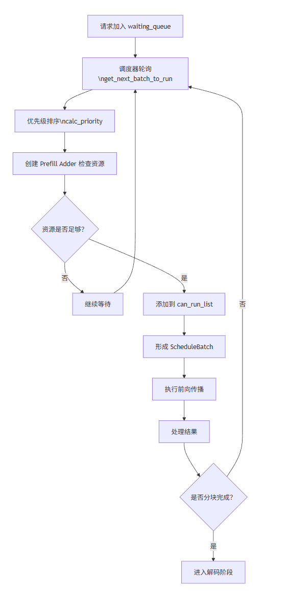

关于chunked prefill的介绍可见文章[chunked-prefill介绍](https://zhuanlan.zhihu.com/p/1996632655073136947)

本章将通过**问题-解答**的方式来探究sglang中是如何实现chunked-prefill的

# 1. 当一个请求进入sglang中是如何流转的

当一个请求发送给sglnag，先通过Tokenizer处理，然后进入watiing_queue（scheduler中），进入waiting_queue之后等待scheduler轮询处理即可，大致流程如图



# 2. 开启chunkedprefill后一个请求如何被切片

启动sglang的时候指定参数`--chunked-prefill-size`即可开启chunked prefill

scheduler轮询调用函数`get_next_batch_to_run`，在这个函数中调用`get_new_batch_prefill`获取另一个新的batch

在`get_new_batch_prefill`中调用`_get_new_batch_prefill_raw`

进入`_get_new_batch_prefill_raw`后就是对chunked prefill比较核心的处理了，在这个函数中会创建一个`PrefillAdder`对象，代码如下：

```python
# Prefill policy
adder = PrefillAdder(
    self.page_size,
    self.tree_cache,
    self.token_to_kv_pool_allocator,
    self.running_batch,
    self.new_token_ratio,
    self.max_prefill_tokens,
    chunked_prefill_size,
    running_bs if self.is_mixed_chunk else 0,
    self.priority_scheduling_preemption_threshold,
    prefill_max_requests=self.server_args.prefill_max_requests,
    prefill_delayer_single_pass=prefill_delayer_single_pass,
    dllm_config=self.dllm_config,
)
```

PrefillAdder 维护多个资源计数器来跟踪可用资源：

- `rem_total_tokens`: 剩余的总token数量
- `rem_input_tokens`: 剩余的输入token数量
- `rem_chunk_tokens`: 剩余的分块token数量