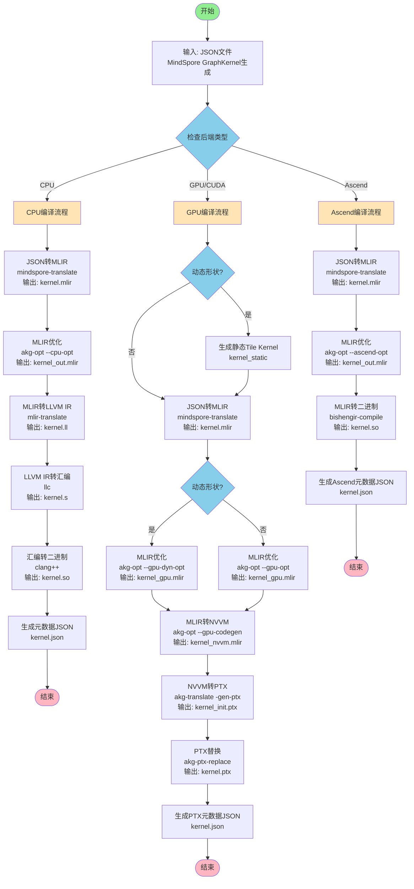

# 1. 方向

三种方向：

1. 底层没有对应的算子需要生成
2. 底层有多个算子选择性能最好的
3. 底层有一个普适性的算子，但需要根据当前参数生成一个性能更好的算子

# 2. 华为AKG项目（auto kernel generator）

[AKG](https://gitee.com/mindspore/akg)是一个自动内核生成编译器，专门用于优化神经处理单元（NPU）上的深度学习计算（现在也支持部分GPU和CPU）。AKG利用多面体模型来自动推导出最佳的内存管理和数据传输策略，同时支持分块和层级融合等高级优化技术。



# 3. 示例

以向量加法为例

输入的JSON描述文件

```json
{
    "op": "vector_add",
    "process": "cuda",
    "input_desc": [
        [
            {
                "tensor_name": "input0",
                "shape": [1024],
                "data_type": "float32"
            }
        ],
        [
            {
                "tensor_name": "input1",
                "shape": [1024],
                "data_type": "float32"
            }
        ]
    ],
    "output_desc": [
        {
            "tensor_name": "output0",
            "shape": [1024],
            "data_type": "float32"
        }
    ],
    "op_desc": [
        {
            "name": "Add",
            "input_desc": [
                [
                    {
                        "tensor_name": "input0",
                        "shape": [1024],
                        "data_type": "float32"
                    }
                ],
                [
                    {
                        "tensor_name": "input1",
                        "shape": [1024],
                        "data_type": "float32"
                    }
                ]
            ],
            "output_desc": [
                {
                    "tensor_name": "output0",
                    "shape": [1024],
                    "data_type": "float32"
                }
            ]
        }
    ]
}
```

## GPU/CUDA 编译流程生成的文件

### 1. vector_add.mlir - 初始MLIR文件

**生成步骤**: `mindspore-translate -json-to-mindspore`

**文件说明**: 将JSON描述转换为MLIR格式，使用MindSpore方言表示计算图。

**示例内容**:
```mlir
module {
  func.func @vector_add(%arg0: tensor<1024xf32>, %arg1: tensor<1024xf32>) -> tensor<1024xf32> attributes {
    mindspore_kernel,
    process = "cuda",
    compute_capability = "sm_70"
  } {
    %0 = "mindspore.add"(%arg0, %arg1) : (tensor<1024xf32>, tensor<1024xf32>) -> tensor<1024xf32>
    return %0 : tensor<1024xf32>
  }
}
```

**特点**:
- 使用 `mindspore` 方言表示算子
- 包含函数签名和属性信息
- 张量类型和形状信息完整保留

---

### 2. vector_add_gpu.mlir - GPU优化后的MLIR文件

**生成步骤**: `akg-opt --gpu-opt` (静态形状) 或 `akg-opt --gpu-dyn-opt` (动态形状)

**文件说明**: 经过GPU特定优化后的MLIR，包括循环tiling、内存提升、向量化等优化。

**示例内容**:
```mlir
module {
  func.func @vector_add_kernel(%arg0: memref<1024xf32>, %arg1: memref<1024xf32>, %arg2: memref<1024xf32>) {
    affine.for %arg3 = 0 to 1024 {
      %0 = affine.load %arg0[%arg3] : memref<1024xf32>
      %1 = affine.load %arg1[%arg3] : memref<1024xf32>
      %2 = arith.addf %0, %1 : f32
      affine.store %2, %arg2[%arg3] : memref<1024xf32>
    }
    return
  }
  
  gpu.module @vector_add_kernel_module {
    gpu.func @vector_add_kernel(%arg0: memref<1024xf32>, %arg1: memref<1024xf32>, %arg2: memref<1024xf32>) kernel {
      // GPU kernel实现
      gpu.block_dim x = 256 : i32
      gpu.grid_dim x = 4 : i32
      // ... 循环展开和向量化优化后的代码 ...
    }
  }
}
```

**特点**:
- 转换为 `affine` 和 `gpu` 方言
- 包含GPU线程配置（block_dim, grid_dim）
- 进行了循环优化和内存访问优化
- 从tensor类型转换为memref类型（更适合GPU内存模型）

---

### 3. vector_add_nvvm.mlir - NVVM格式的MLIR文件

**生成步骤**: `akg-opt --gpu-codegen`

**文件说明**: 转换为NVVM（NVIDIA Virtual Machine）方言的MLIR，这是生成PTX代码的中间表示。

**示例内容**:
```mlir
module {
  nvvm.module @vector_add_kernel_module {
    nvvm.func @vector_add_kernel(%arg0: !llvm.ptr<f32>, %arg1: !llvm.ptr<f32>, %arg2: !llvm.ptr<f32>) kernel {
      // NVVM指令序列
      %0 = nvvm.read.ptx.sreg.tid.x : i32
      %1 = nvvm.read.ptx.sreg.ctaid.x : i32
      %2 = nvvm.read.ptx.sreg.ntid.x : i32
      %3 = arith.muli %1, %2 : i32
      %4 = arith.addi %3, %0 : i32
      %5 = arith.cmpi ult, %4, %c1024 : i32
      scf.if %5 {
        %6 = llvm.getelementptr %arg0[%4] : (!llvm.ptr<f32>, i32) -> !llvm.ptr<f32>
        %7 = llvm.load %6 : !llvm.ptr<f32>
        %8 = llvm.getelementptr %arg1[%4] : (!llvm.ptr<f32>, i32) -> !llvm.ptr<f32>
        %9 = llvm.load %8 : !llvm.ptr<f32>
        %10 = arith.addf %7, %9 : f32
        %11 = llvm.getelementptr %arg2[%4] : (!llvm.ptr<f32>, i32) -> !llvm.ptr<f32>
        llvm.store %10, %11 : !llvm.ptr<f32>
      }
      nvvm.return
    }
  }
}
```

**特点**:
- 使用 `nvvm` 和 `llvm` 方言
- 包含PTX寄存器读取指令（如 `nvvm.read.ptx.sreg.tid.x`）
- 包含线程索引计算和边界检查
- 接近底层GPU执行模型

---

### 4. vector_add_init.ptx - 初始PTX文件

**生成步骤**: `akg-translate -gen-ptx`

**文件说明**: 从NVVM MLIR生成的初始PTX（Parallel Thread Execution）汇编代码。

**示例内容**:
```ptx
.version 7.0
.target sm_70
.address_size 64

.visible .entry vector_add_kernel(
    .param .u64 vector_add_kernel_param_0,
    .param .u64 vector_add_kernel_param_1,
    .param .u64 vector_add_kernel_param_2
)
{
    .reg .pred %p<2>;
    .reg .f32 %f<4>;
    .reg .b32 %r<10>;
    .reg .b64 %rd<7>;

    ld.param.u64 %rd1, [vector_add_kernel_param_0];
    ld.param.u64 %rd2, [vector_add_kernel_param_1];
    ld.param.u64 %rd3, [vector_add_kernel_param_2];
    
    mov.u32 %r1, %tid.x;
    mov.u32 %r2, %ctaid.x;
    mov.u32 %r3, %ntid.x;
    mad.lo.s32 %r4, %r2, %r3, %r1;
    setp.lt.u32 %p1, %r4, 1024;
    
    @%p1 bra $L__BB0_2;
    bra.uni $L__BB0_3;
    
$L__BB0_2:
    cvta.to.global.u64 %rd4, %rd1;
    mul.wide.u32 %rd5, %r4, 4;
    add.s64 %rd6, %rd4, %rd5;
    ld.global.f32 %f1, [%rd6];
    
    cvta.to.global.u64 %rd7, %rd2;
    add.s64 %rd8, %rd7, %rd5;
    ld.global.f32 %f2, [%rd8];
    
    add.f32 %f3, %f1, %f2;
    
    cvta.to.global.u64 %rd9, %rd3;
    add.s64 %rd10, %rd9, %rd5;
    st.global.f32 [%rd10], %f3;
    
$L__BB0_3:
    ret;
}
```

**特点**:
- PTX汇编语言格式
- 包含寄存器声明和指令序列
- 包含线程索引计算和内存访问
- 可能包含占位符或需要替换的符号

---

### 5. vector_add.ptx - 最终PTX文件

**生成步骤**: `akg-ptx-replace`

**文件说明**: 经过PTX替换处理后的最终PTX文件，所有占位符和符号已被替换为实际值。

**示例内容**:
```ptx
.version 7.0
.target sm_70
.address_size 64

.visible .entry vector_add_kernel(
    .param .u64 vector_add_kernel_param_0,
    .param .u64 vector_add_kernel_param_1,
    .param .u64 vector_add_kernel_param_2
)
{
    .reg .pred %p<2>;
    .reg .f32 %f<4>;
    .reg .b32 %r<10>;
    .reg .b64 %rd<7>;

    ld.param.u64 %rd1, [vector_add_kernel_param_0];
    ld.param.u64 %rd2, [vector_add_kernel_param_1];
    ld.param.u64 %rd3, [vector_add_kernel_param_2];
    
    mov.u32 %r1, %tid.x;
    mov.u32 %r2, %ctaid.x;
    mov.u32 %r3, %ntid.x;
    mad.lo.s32 %r4, %r2, %r3, %r1;
    mov.u32 %r5, 1024;
    setp.lt.u32 %p1, %r4, %r5;
    
    @%p1 bra $L__BB0_2;
    bra.uni $L__BB0_3;
    
$L__BB0_2:
    cvta.to.global.u64 %rd4, %rd1;
    mul.wide.u32 %rd5, %r4, 4;
    add.s64 %rd6, %rd4, %rd5;
    ld.global.f32 %f1, [%rd6];
    
    cvta.to.global.u64 %rd7, %rd2;
    add.s64 %rd8, %rd7, %rd5;
    ld.global.f32 %f2, [%rd8];
    
    add.f32 %f3, %f1, %f2;
    
    cvta.to.global.u64 %rd9, %rd3;
    add.s64 %rd10, %rd9, %rd5;
    st.global.f32 [%rd10], %f3;
    
$L__BB0_3:
    ret;
}
```

**特点**:
- 所有符号和占位符已被替换
- 可以直接被CUDA运行时加载执行
- 包含完整的线程配置和内存访问模式

---

### 6. vector_add.json - 元数据JSON文件

**生成步骤**: `_run_ptx_dump_json`

**文件说明**: 包含内核元数据信息，用于运行时加载和执行PTX代码。

**示例内容**:
```json
{
    "kernelName": "vector_add_kernel",
    "blockDim": [256, 1, 1],
    "gridDim": [4, 1, 1],
    "threadNumber": 1024,
    "dynamic": false,
    "sha256": "a1b2c3d4e5f6...",
    "targetInfo": {
        "compute_capability": "sm_70",
        "arch": "sm_70"
    },
    "inputShapes": [[1024], [1024]],
    "outputShapes": [[1024]],
    "inputTypes": ["float32", "float32"],
    "outputTypes": ["float32"]
}
```

**字段说明**:
- `kernelName`: CUDA内核函数名
- `blockDim`: 线程块维度 [x, y, z]
- `gridDim`: 网格维度 [x, y, z]
- `threadNumber`: 总线程数
- `dynamic`: 是否为动态形状
- `sha256`: PTX文件的SHA256校验和
- `targetInfo`: 目标GPU架构信息
- `inputShapes`/`outputShapes`: 输入/输出张量形状
- `inputTypes`/`outputTypes`: 输入/输出数据类型

# 4.其他

[生成pytorch算子](https://zhuanlan.zhihu.com/p/1274248985)

[大模型生成triton算子](https://www.chatpaper.ai/zh/dashboard/paper/4a80046b-0fd4-49a3-ae17-8145fb5991ff)

[Triton-Copilot](https://www.top100summit.com/detail?id=18861)